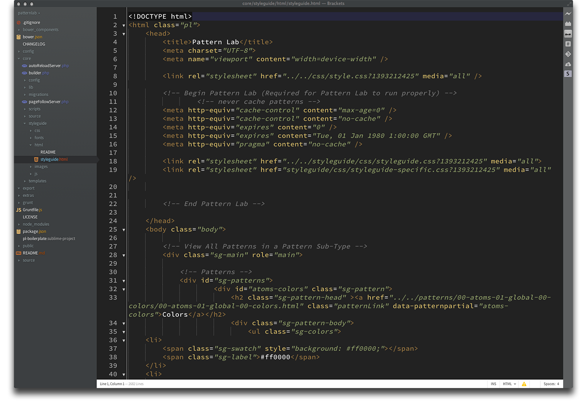
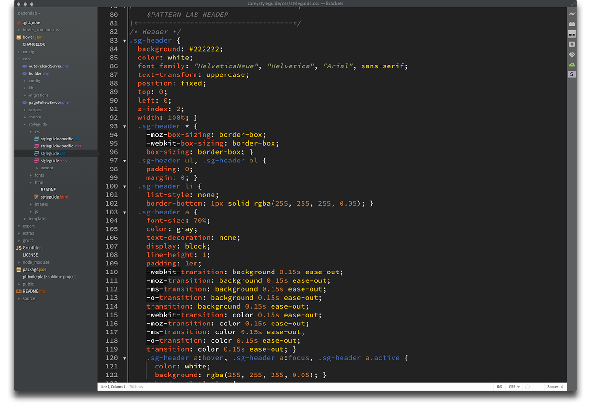
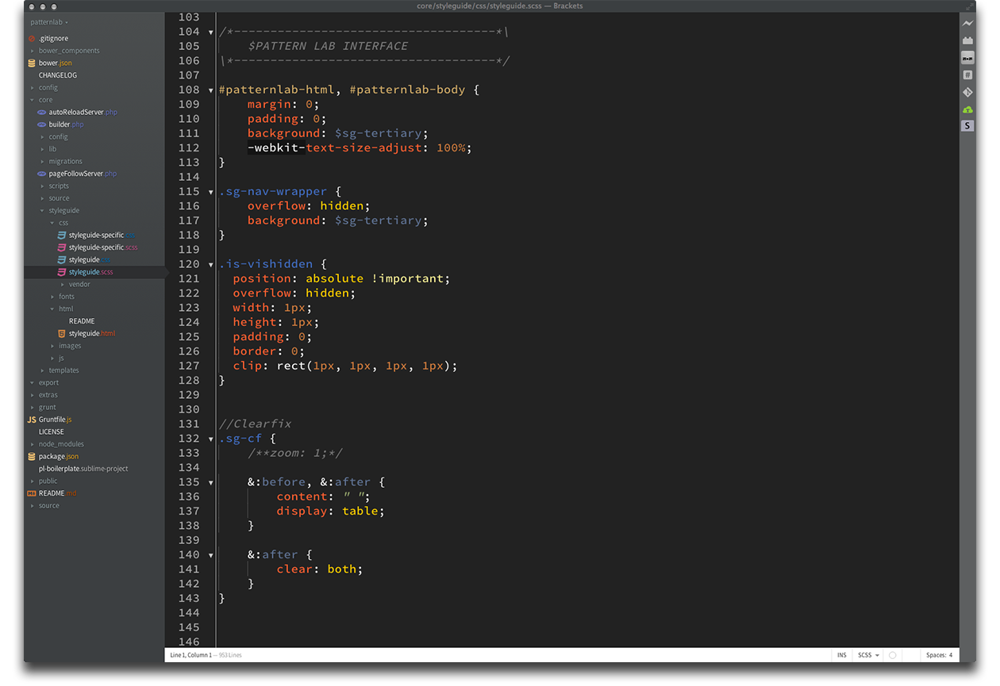
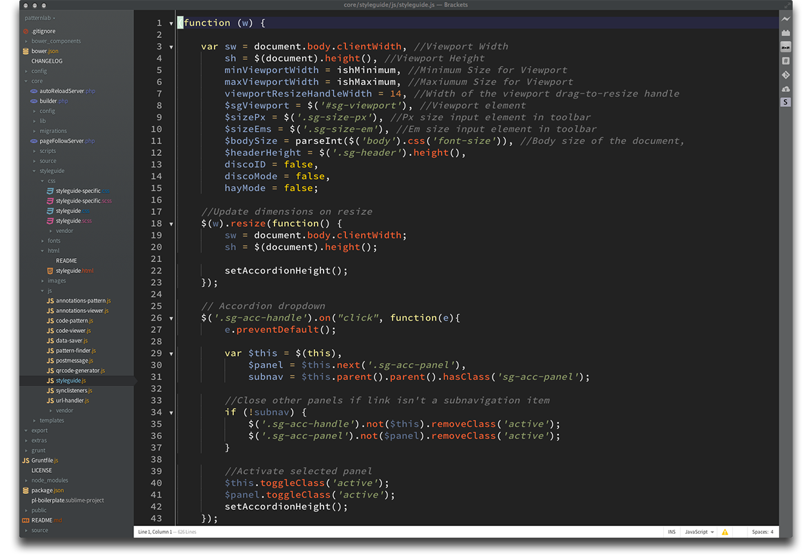
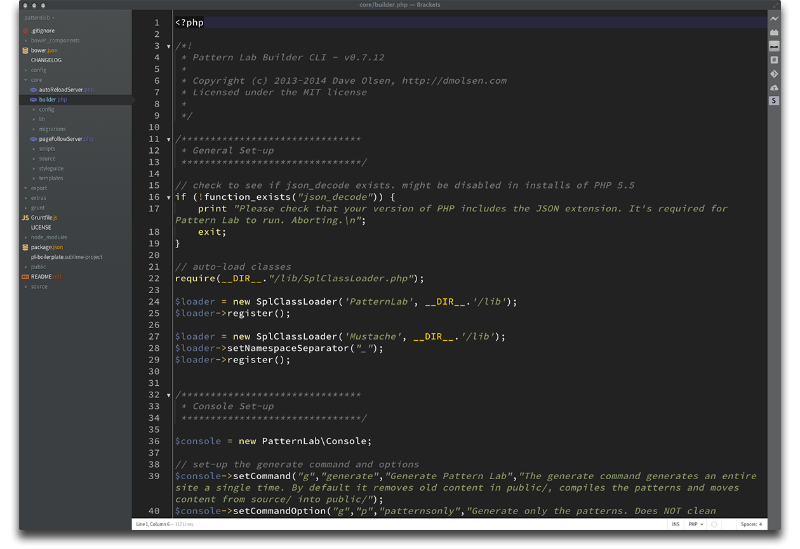

TWILIGHTESQUE
=============

This theme for the Brackets editor is based upon MiguelCastillo's BoilerPlate and the CodeMirror/Sublime theme *Twilight*.

### Screenshots ###

#### HTML

#### CSS

#### SCSS

#### JavaScript

#### PHP

### How do I install this theme? ###

This extension requires Brackets Release 42 or newer.

1. Install the theme by opening the Brackets extension manager and use the url https://github.com/ninthart/Twilightesque.git.
    1. Or you can download it as a zip from the github repository (https://github.com/ninthart/Twilightesque/) and drag the zip file into the extension manager.
1. In Brackets, select the 'View' menu item and choose Themes
1. Choose "Twilightesque" as the theme.
1. Profit!

### Please note… ###

This is a work in progress, and I may well change the colours slightly from time to time. You are, of course, very welcome to clone this repo and make your own changes…

### Recommended typeface ###

This theme looks great when when you use the new Input: Fonts for code from Font Bureau. Designed by David John Ross, these fonts are excellent for coding and are a delight to use day in, day out. I can't recommend them enough (no, I'm not being paid for this testimonial). You can get them for free (for personal use) from http://input.fontbureau.com. Read the Info section of the website too, as it's an incredible look at type for coding purposes.

### License ###

The MIT License. Read [LICENSE](LICENSE) for further information.
